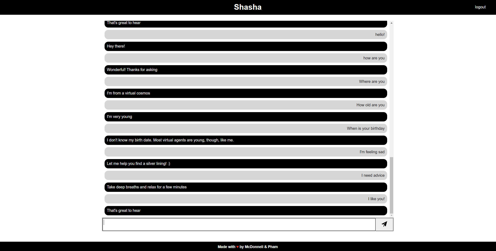

# Shasha 🤖

## Purpose
A chat bot made to help people when they are down! Let our bot, Shasha, help you relieve some stress today!

## Deployment
Talk to Shasha at this Heroku deployment: https://shielded-bayou-08776.herokuapp.com/

# Built with

- Javascript
- Nodejs
- Express
- MySQL
- Sequelize
- Heroku
- Node-NLP
- Bcrypt
- dotenv
- Handlebars
- Express-session
- Express-handlebars
- Connect-session-sequelize
- CSS

## Licence

## Contribution
Made with ❤️ by Jonathan McDonnell & Vulong Pham